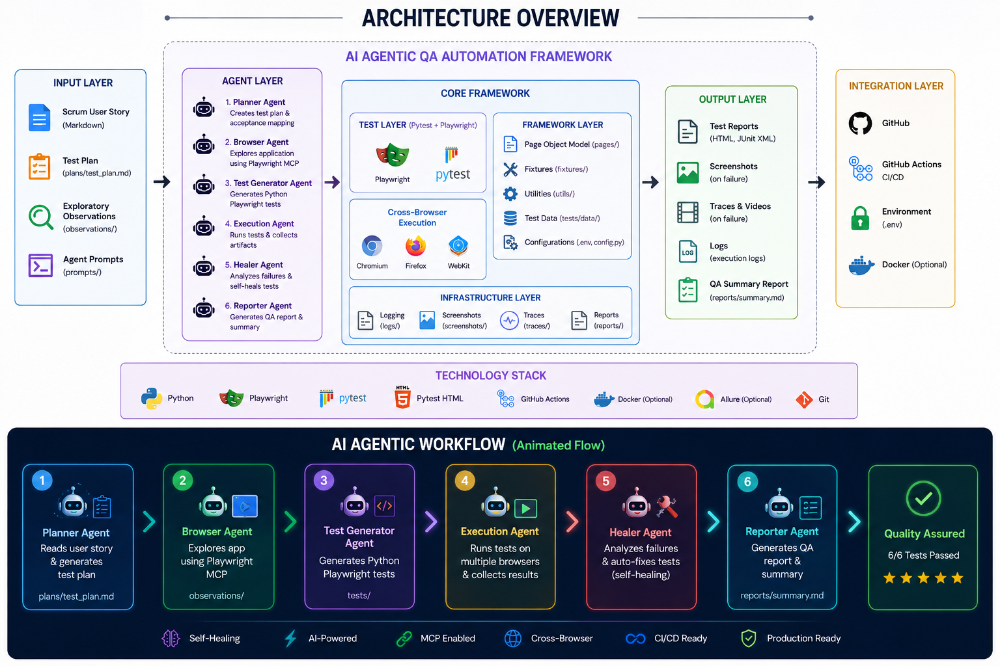
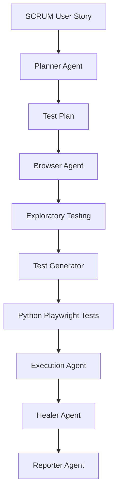
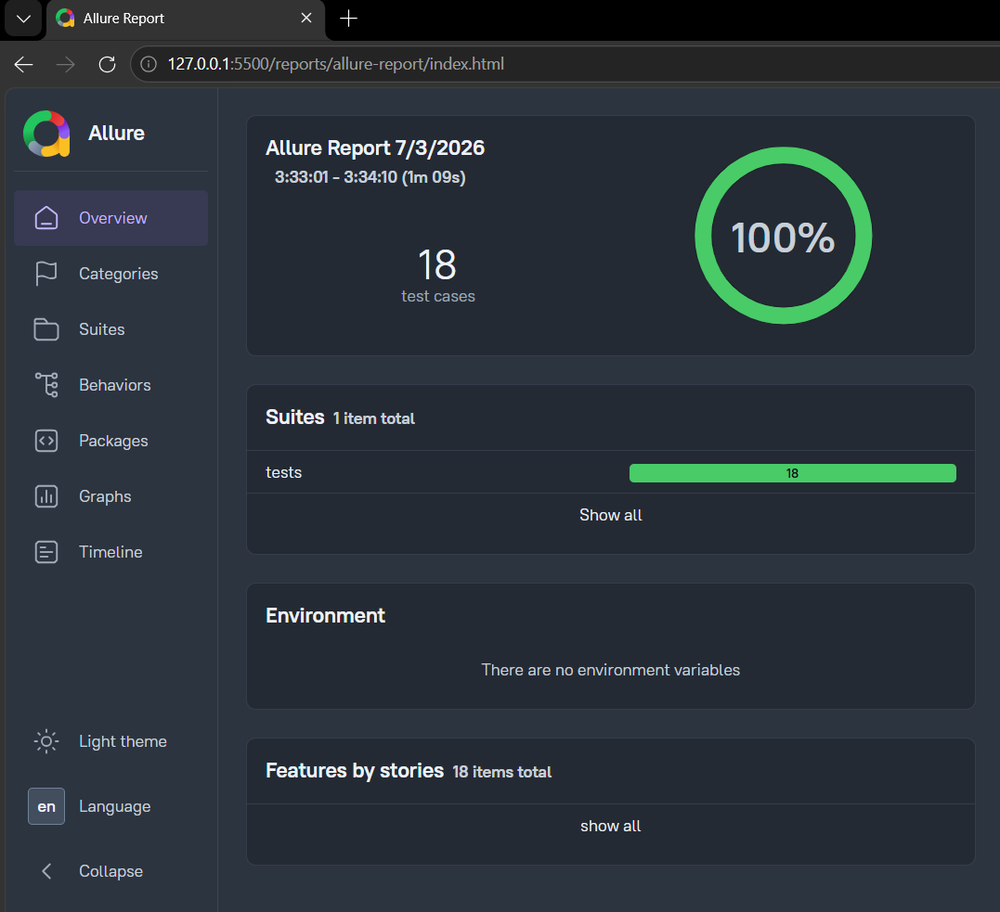
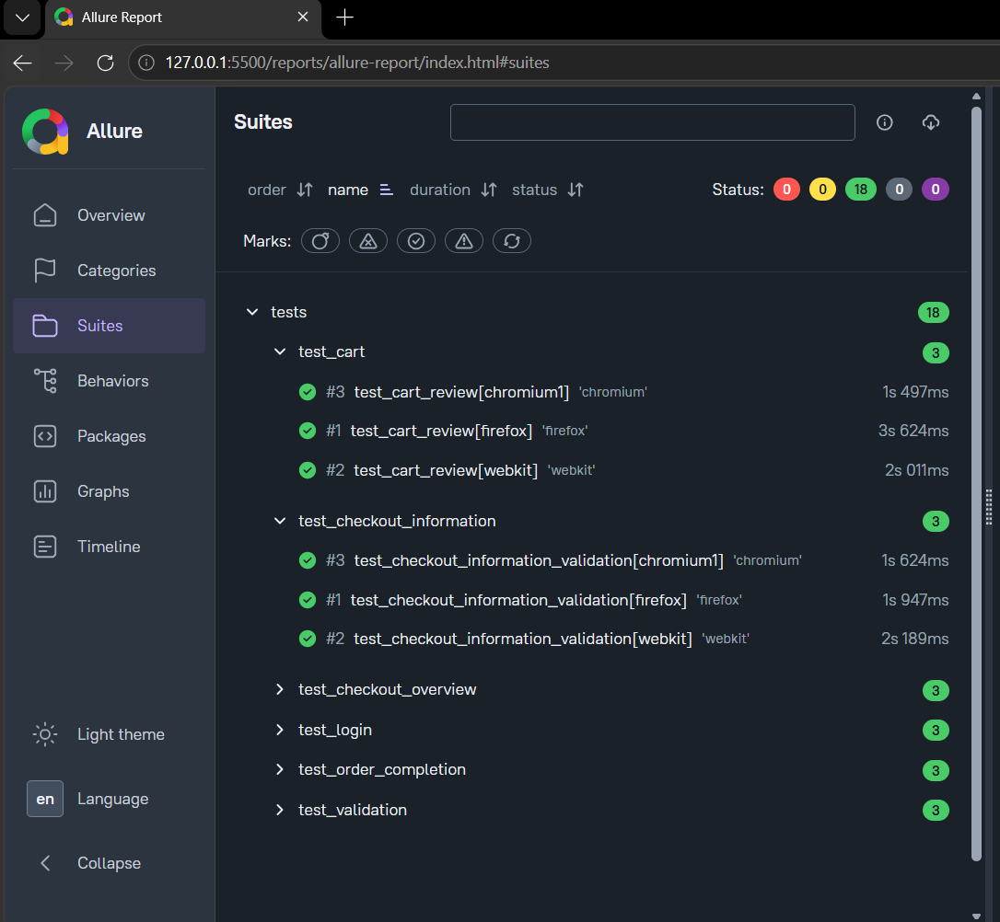
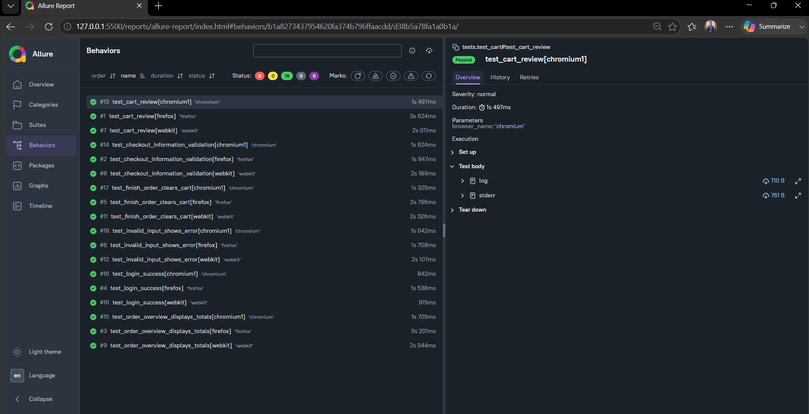
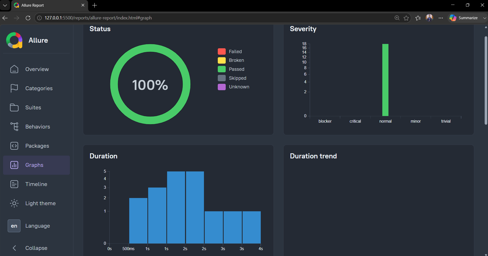
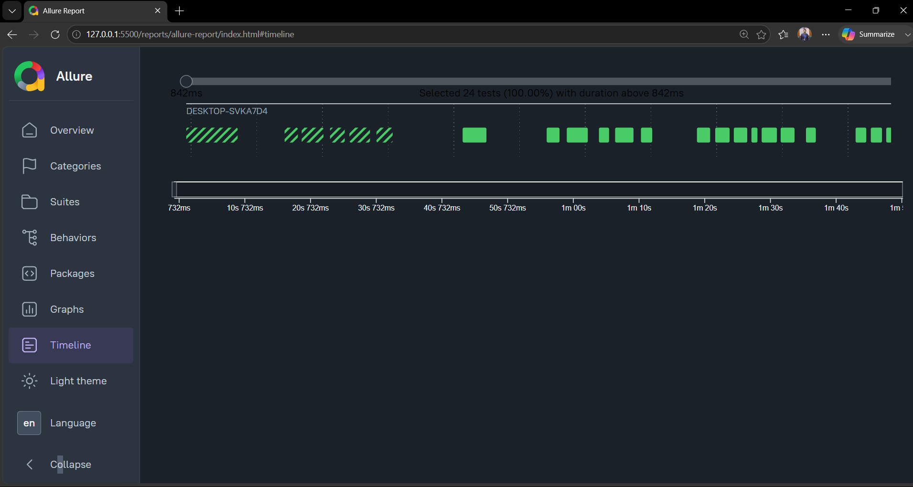

# 🤖 AI-Powered Playwright Test Automation Framework (Python)


---

# 📌 Project Overview

This repository demonstrates an **AI-assisted end-to-end QA Automation Framework** built using **Python**, **Playwright**, and **Pytest**.

Instead of manually writing automation scripts, the framework leverages **GitHub Copilot Agent Mode** together with the **Playwright Model Context Protocol (MCP)** to automate the complete software testing lifecycle:

- Read Scrum User Stories
- Generate Test Plans
- Perform Exploratory Testing
- Generate Playwright Python Tests
- Execute Automated Tests
- Self-Heal Test Failures
- Generate Professional QA Reports


<p align="center">
  
</p>

📖 **Detailed Design Documentation:**  
➡️ **[docs/architecture.md](docs/architecture.md)**

The project follows modern QA engineering practices including the **Page Object Model (POM)**, reusable fixtures, environment-driven configuration, CI/CD readiness, and AI-assisted development.

---

# 🚀 Key Features

- ✅ AI-assisted Test Planning
- ✅ Playwright MCP Browser Exploration
- ✅ Page Object Model (POM)
- ✅ Python Playwright Automation
- ✅ Pytest Framework
- ✅ Cross-browser Testing
- ✅ Automatic Screenshot Capture
- ✅ Playwright Trace Collection
- ✅ HTML & JUnit Reporting
- ✅ Self-Healing Test Workflow
- ✅ Environment-based Configuration
- ✅ GitHub Actions Ready
- ✅ Production-quality Project Structure

---

# 🧠 AI Agent Workflow

The framework uses an Agentic workflow where each AI agent has a dedicated responsibility.



---

# 🏗️ Workflow

## 1. Planner Agent

Reads the Scrum User Story and generates:

- Functional Test Scenarios
- Negative Test Cases
- Edge Cases
- Acceptance Criteria Mapping
- Exploratory Testing Checklist

Output:

```
plans/test_plan.md
```

---

## 2. Browser Agent

Uses Playwright MCP to:

- Launch Browser
- Login
- Explore Application
- Validate Acceptance Criteria
- Capture Screenshots
- Record Observations

Output:

```
observations/
screenshots/
```

---

## 3. Test Generator Agent

Generates production-ready Python Playwright tests using:

- pytest
- Page Object Model
- Reusable Fixtures
- Explicit Assertions
- Explicit Waits

Output:

```
tests/
```

---

## 4. Execution Agent

Runs the automation suite.

Generates:

- HTML Report
- JUnit XML
- Screenshots
- Playwright Traces

---

## 5. Healer Agent

Automatically analyzes failures and fixes:

- Broken Locators
- Invalid Assertions
- Timing Issues
- Flaky Tests

---

## 6. Reporter Agent

Produces professional QA documentation:

- Test Summary
- Defect Report
- Coverage Report
- Recommendations

---

# 📁 Project Structure

```text
AI-Playwright-MCP/

│
├── .github/
│   ├── agents/
│   └── workflows/
│
├── .vscode/
│   └── mcp.json
│
├── fixtures/
│
├── pages/
│
├── plans/
│
├── prompts/
│
├── reports/
│
├── screenshots/
│
├── observations/
│
├── test-results/
│
├── tests/
│
├── user-stories/
│
├── utils/
│
├── conftest.py
├── README.md
├── requirements.txt
└── main.py
```

---

# ⚙️ Technology Stack

| Technology | Purpose |
|------------|----------|
| Python 3.11+ | Programming Language |
| Playwright | Browser Automation |
| Pytest | Test Framework |
| pytest-playwright | Playwright Integration |
| pytest-html | HTML Reporting |
| pytest-xdist | Parallel Execution |
| python-dotenv | Environment Variables |
| GitHub Copilot Agent | AI Code Generation |
| Playwright MCP | Browser Control |
| GitHub Actions | CI/CD |

---

# 🛠️ Installation

## Clone Repository

```bash
git clone <repository-url>

cd AI-Playwright-MCP
```

---

## Create Virtual Environment

### Windows

```bash
python -m venv venv

venv\Scripts\activate
```

### Linux / macOS

```bash
python3 -m venv venv

source venv/bin/activate
```

---

## Install Dependencies

```bash
pip install -r requirements.txt
```

---

## Install Playwright Browsers

```bash
playwright install
```

---

## Configure Environment

Create a `.env` file.

```env
BASE_URL=https://www.saucedemo.com

USERNAME=standard_user

PASSWORD=secret_sauce
```

---

# ▶️ Running Tests

Run all tests:

```bash
pytest -v
```

Run specific test:

```bash
pytest tests/test_login.py
```

Run with HTML report:

```bash
pytest --html=reports/report.html --self-contained-html
```

Run with Allure results:

```bash
pytest --alluredir=reports/allure-results
```

Generate the Allure HTML report:

```bash
allure generate reports/allure-results -o reports/allure-report --clean
```

Open the report at:

```bash
reports/allure-report/index.html
```

Run in Chromium only:

```bash
pytest --browser chromium
```

Run in Firefox:

```bash
pytest --browser firefox
```

Run in WebKit:

```bash
pytest --browser webkit
```

---

# SCRUM-101 Final Report

## Executive Summary

This report summarizes the testing outcome for SCRUM-101: E-commerce Checkout Process on https://www.saucedemo.com.
The project includes a Playwright-based automation framework, environment-driven configuration, cross-browser support for Chromium/Firefox/WebKit, and parallel execution via `pytest-xdist`.
Exploratory validation and automation coverage were completed for the core checkout workflow, and the framework now supports automated capture of traces, screenshots, and video artifacts.

## Requirements

- Validate the Sauce Demo checkout process from login through order confirmation.
- Ensure cart review, checkout information entry, order overview, and order completion flows work correctly.
- Support validation and error handling for required checkout fields.
- Implement automated Playwright tests for desktop browsers and future mobile coverage.
- Generate test artifacts and reports for CI execution.

## Acceptance Criteria

- AC1: Cart Review — items in the cart display correct details, totals, and checkout options.
- AC2: Checkout Information Entry — checkout form fields are mandatory and validation errors appear for missing values.
- AC3: Order Overview — valid checkout data leads to an order summary page showing payment, shipping, subtotal, tax, and total.
- AC4: Order Completion — clicking `Finish` navigates to a confirmation page with success messaging and a `Back Home` button.
- AC5: Error Handling — invalid or incomplete data must prevent checkout progression and show appropriate errors.

## Test Plan

The test plan covered both automated and manual activities for the checkout flow.
Key focus areas included:

- Happy path flow from inventory to order confirmation.
- Required field validation on checkout information.
- Order overview accuracy and final order confirmation.
- Browser coverage for Chromium, Firefox, and WebKit.
- Parallel execution, logging, and artifact capture.

### Test Cases

1. TC-AC1-01: Cart Review — verify items, descriptions, pricing, and checkout buttons.
2. TC-AC2-01: Checkout Info — verify required fields on the checkout form.
3. TC-AC2-02: Checkout Info Invalid Input — validate behavior for invalid/edge-case input.
4. TC-AC3-01: Order Overview — verify order summary, costs, and controls.
5. TC-AC4-01: Order Completion — verify success page and cart reset.
6. TC-AC5-01: Cancel Checkout — verify cancellation returns user to cart.
7. TC-NAV-01: Back Button Behavior — verify navigation consistency through checkout.

## Exploratory Findings

A manual exploratory pass was executed for the primary checkout workflow.
Findings include:

- Login succeeded with `standard_user` and redirected to inventory.
- Items could be added to cart and the cart page displayed them correctly.
- Checkout information page displayed First Name, Last Name, and Zip/Postal Code fields.
- Empty field submission produced validation error feedback.
- Order overview showed item summary, payment info, shipping info, subtotal, tax, and total.
- Order completion navigated to a confirmation page with success messaging and `Back Home`.
- The cart was cleared after order completion in the observed flow.
- Console errors were visible on the page during the exploratory test; they did not block the checkout path but should be reviewed.
- Mobile responsiveness and full multi-browser exploratory coverage were not completed in this session.

## Automation Results

Automation was executed against the core checkout scenario using the existing Playwright framework.
Current results show:

- Automated tests were implemented for login, cart review, checkout validation, order overview, order completion, and invalid input handling.
- The framework now records Playwright traces for each test and saves them under `traces/`.
- Logs indicate successful trace generation for these tests on Chromium:
  - `test_cart_review[chromium].zip`
  - `test_checkout_information_validation[chromium].zip`
  - `test_order_overview_displays_totals[chromium].zip`
  - `test_login_success[chromium].zip`
  - `test_finish_order_clears_cart[chromium].zip`
  - `test_invalid_input_shows_error[chromium].zip`
- Cross-browser support is configured in `pyproject.toml` and CI workflow, with Chromium/Firefox/WebKit set for automatic execution.

## Bugs Found

No functional defects were observed in the main checkout automation path during the current execution.
However, the following issues were noted:

- Page console errors were observed on the inventory page during exploratory testing.
- Mobile-responsive and browser-specific validation were not fully exercised in the current run.

These items are candidates for follow-up investigation rather than confirmed functional bugs.

## Healing Actions

The project received the following healing and stabilization actions during work:

- Centralized configuration in `utils/config.py` for base URL, credentials, and artifact directories.
- Added worker-specific artifact directories for `pytest-xdist` compatibility.
- Standardized browser execution options with `--browser chromium --browser firefox --browser webkit` in `pyproject.toml`.
- Updated `README.md` to reflect the cross-browser run command and execution notes.
- Implemented Playwright trace, screenshot, and video capture support for failed tests.
- Added logging and retry support for more stable automated execution.

## Final Status

The core SCRUM-101 checkout workflow is automated and validated on Chromium.
The framework supports cross-browser execution and parallel runs, with artifact capture enabled.
Some exploratory coverage remains to be completed for Firefox/WebKit and mobile viewport validations.
Overall, the project has achieved the primary Definition of Done items for automation, documentation, and artifact generation.

## Coverage

- AC1: Covered by both exploratory validation and automated cart review tests.
- AC2: Covered by exploratory tests and automated checkout validation.
- AC3: Covered by exploratory verification and automated order overview assertions.
- AC4: Covered by exploratory and automated order completion tests.
- AC5: Partially covered by exploratory empty-field validation and automated invalid-input verification.

Automation coverage status:

- Desktop checkout flow: implemented.
- Required field validation: implemented.
- Multi-browser execution: configured and ready, with Chromium validated.
- Mobile/responsive coverage: recommended next step.

## Recommendations

1. Execute the full browser matrix on Chromium, Firefox, and WebKit to confirm cross-browser behavior.
2. Add explicit mobile viewport and device-emulation tests for checkout responsiveness.
3. Investigate and triage the console errors observed during exploratory testing.
4. Extend negative validation tests for special characters and edge-case form inputs.
5. Add Allure or HTML test reporting to summarize results across browser runs.
6. Continue logging and artifact review for any intermittent failures in CI.

---

Generated on 2026-07-03 for SCRUM-101.


---

# 📊 Reports

Generated artifacts include:

```
reports/
```

- HTML Report
- JUnit XML
- Markdown Summary
- Allure result files (`reports/allure-results/`)
- Allure HTML report (`reports/allure-report/`)

```
screenshots/
```

- Failure Screenshots

```
test-results/
```

- Playwright Traces
- Videos (optional)

---

## 📊 Allure Report

The framework generates an interactive **Allure Report** after every test execution, providing:

- 📈 Test execution summary
- ✅ Passed / Failed / Skipped tests
- 📊 Trends & history
- 📂 Test suites
- ⏱️ Execution timeline
- 📸 Failure screenshots
- 🎥 Playwright traces
- 📝 Detailed stack traces

### Allure Report 1

<p align="center">
  
</p>

### Allure Report 2

<p align="center">
  
</p>
### Allure Report 3

<p align="center">
  
</p>
### Allure Report 4

<p align="center">
  
</p>
### Allure Report 5

<p align="center">
  
</p>

# 📈 Test Coverage

The framework validates the complete SauceDemo checkout workflow:

- User Login
- Product Selection
- Shopping Cart
- Checkout Information
- Checkout Overview
- Order Completion
- Form Validation
- Navigation Flow
- Negative Scenarios

---

# 🤖 AI Development Workflow

This project was developed using:

- GitHub Copilot Agent Mode
- Playwright MCP Server
- AI-generated Test Plans
- AI-generated Page Objects
- AI-assisted Debugging
- AI-powered Self-Healing
- AI-generated QA Reports

---

# 🔄 Continuous Integration

The project supports GitHub Actions for:

- Dependency Installation
- Playwright Browser Installation
- Test Execution
- HTML Report Upload
- JUnit Results
- Screenshot Collection

---

# 📌 Future Improvements

- Allure Reporting
- Data-Driven Testing
- API Testing Integration
- Accessibility Testing
- Performance Testing
- Visual Regression Testing
- BrowserStack Integration
- Sauce Labs Integration
- Docker Support
- AI Defect Classification

---

# 📷 Demo Workflow

```
Scrum User Story
        │
        ▼
Planner Agent
        │
        ▼
Test Plan
        │
        ▼
Browser Agent (MCP)
        │
        ▼
Exploratory Testing
        │
        ▼
Test Generator
        │
        ▼
Python Playwright Tests
        │
        ▼
Pytest Execution
        │
        ▼
Healer Agent
        │
        ▼
Reporter Agent
        │
        ▼
Final QA Report
```

---

# 📄 License

This project is released under the MIT License.

---

# 👨‍💻 Author

**Avijit Chowdhury**

QA Automation Engineer | AI-Assisted Testing | Playwright | Python | GitHub Copilot | MCP