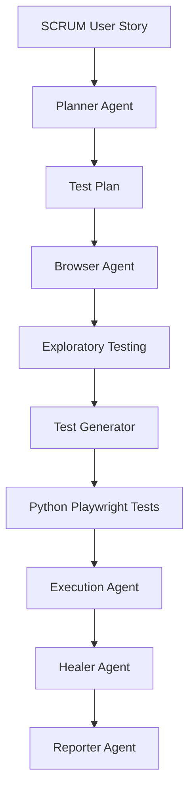

# 🤖 AI-Powered Playwright Test Automation Framework (Python)


---

# 📌 Project Overview

This repository demonstrates an **AI-assisted end-to-end QA Automation Framework** built using **Python**, **Playwright**, and **Pytest**.

Instead of manually writing automation scripts, the framework leverages **GitHub Copilot Agent Mode** together with the **Playwright Model Context Protocol (MCP)** to automate the complete software testing lifecycle:

- Read Scrum User Stories
- Generate Test Plans
- Perform Exploratory Testing
- Generate Playwright Python Tests
- Execute Automated Tests
- Self-Heal Test Failures
- Generate Professional QA Reports

The project follows modern QA engineering practices including the **Page Object Model (POM)**, reusable fixtures, environment-driven configuration, CI/CD readiness, and AI-assisted development.

---

# 🚀 Key Features

- ✅ AI-assisted Test Planning
- ✅ Playwright MCP Browser Exploration
- ✅ Page Object Model (POM)
- ✅ Python Playwright Automation
- ✅ Pytest Framework
- ✅ Cross-browser Testing
- ✅ Automatic Screenshot Capture
- ✅ Playwright Trace Collection
- ✅ HTML & JUnit Reporting
- ✅ Self-Healing Test Workflow
- ✅ Environment-based Configuration
- ✅ GitHub Actions Ready
- ✅ Production-quality Project Structure

---

# 🧠 AI Agent Workflow

The framework uses an Agentic workflow where each AI agent has a dedicated responsibility.



---

# 🏗️ Workflow

## 1. Planner Agent

Reads the Scrum User Story and generates:

- Functional Test Scenarios
- Negative Test Cases
- Edge Cases
- Acceptance Criteria Mapping
- Exploratory Testing Checklist

Output:

```
plans/test_plan.md
```

---

## 2. Browser Agent

Uses Playwright MCP to:

- Launch Browser
- Login
- Explore Application
- Validate Acceptance Criteria
- Capture Screenshots
- Record Observations

Output:

```
observations/
screenshots/
```

---

## 3. Test Generator Agent

Generates production-ready Python Playwright tests using:

- pytest
- Page Object Model
- Reusable Fixtures
- Explicit Assertions
- Explicit Waits

Output:

```
tests/
```

---

## 4. Execution Agent

Runs the automation suite.

Generates:

- HTML Report
- JUnit XML
- Screenshots
- Playwright Traces

---

## 5. Healer Agent

Automatically analyzes failures and fixes:

- Broken Locators
- Invalid Assertions
- Timing Issues
- Flaky Tests

---

## 6. Reporter Agent

Produces professional QA documentation:

- Test Summary
- Defect Report
- Coverage Report
- Recommendations

---

# 📁 Project Structure

```text
AI-Playwright-MCP/

│
├── .github/
│   ├── agents/
│   └── workflows/
│
├── .vscode/
│   └── mcp.json
│
├── fixtures/
│
├── pages/
│
├── plans/
│
├── prompts/
│
├── reports/
│
├── screenshots/
│
├── observations/
│
├── test-results/
│
├── tests/
│
├── user-stories/
│
├── utils/
│
├── conftest.py
├── README.md
├── requirements.txt
└── main.py
```

---

# ⚙️ Technology Stack

| Technology | Purpose |
|------------|----------|
| Python 3.11+ | Programming Language |
| Playwright | Browser Automation |
| Pytest | Test Framework |
| pytest-playwright | Playwright Integration |
| pytest-html | HTML Reporting |
| pytest-xdist | Parallel Execution |
| python-dotenv | Environment Variables |
| GitHub Copilot Agent | AI Code Generation |
| Playwright MCP | Browser Control |
| GitHub Actions | CI/CD |

---

# 🛠️ Installation

## Clone Repository

```bash
git clone <repository-url>

cd AI-Playwright-MCP
```

---

## Create Virtual Environment

### Windows

```bash
python -m venv venv

venv\Scripts\activate
```

### Linux / macOS

```bash
python3 -m venv venv

source venv/bin/activate
```

---

## Install Dependencies

```bash
pip install -r requirements.txt
```

---

## Install Playwright Browsers

```bash
playwright install
```

---

## Configure Environment

Create a `.env` file.

```env
BASE_URL=https://www.saucedemo.com

USERNAME=standard_user

PASSWORD=secret_sauce
```

---

# ▶️ Running Tests

Run all tests:

```bash
pytest -v
```

Run specific test:

```bash
pytest tests/test_login.py
```

Run with HTML report:

```bash
pytest --html=reports/report.html --self-contained-html
```

Run in Chromium only:

```bash
pytest --browser chromium
```

Run in Firefox:

```bash
pytest --browser firefox
```

Run in WebKit:

```bash
pytest --browser webkit
```

---

# 📊 Reports

Generated artifacts include:

```
reports/
```

- HTML Report
- JUnit XML
- Markdown Summary

```
screenshots/
```

- Failure Screenshots

```
test-results/
```

- Playwright Traces
- Videos (optional)

---

# 📈 Test Coverage

The framework validates the complete SauceDemo checkout workflow:

- User Login
- Product Selection
- Shopping Cart
- Checkout Information
- Checkout Overview
- Order Completion
- Form Validation
- Navigation Flow
- Negative Scenarios

---

# 🤖 AI Development Workflow

This project was developed using:

- GitHub Copilot Agent Mode
- Playwright MCP Server
- AI-generated Test Plans
- AI-generated Page Objects
- AI-assisted Debugging
- AI-powered Self-Healing
- AI-generated QA Reports

---

# 🔄 Continuous Integration

The project supports GitHub Actions for:

- Dependency Installation
- Playwright Browser Installation
- Test Execution
- HTML Report Upload
- JUnit Results
- Screenshot Collection

---

# 📌 Future Improvements

- Allure Reporting
- Data-Driven Testing
- API Testing Integration
- Accessibility Testing
- Performance Testing
- Visual Regression Testing
- BrowserStack Integration
- Sauce Labs Integration
- Docker Support
- AI Defect Classification

---

# 📷 Demo Workflow

```
Scrum User Story
        │
        ▼
Planner Agent
        │
        ▼
Test Plan
        │
        ▼
Browser Agent (MCP)
        │
        ▼
Exploratory Testing
        │
        ▼
Test Generator
        │
        ▼
Python Playwright Tests
        │
        ▼
Pytest Execution
        │
        ▼
Healer Agent
        │
        ▼
Reporter Agent
        │
        ▼
Final QA Report
```

---

# 📄 License

This project is released under the MIT License.

---

# 👨‍💻 Author

**Avijit Chowdhury**

QA Automation Engineer | AI-Assisted Testing | Playwright | Python | GitHub Copilot | MCP