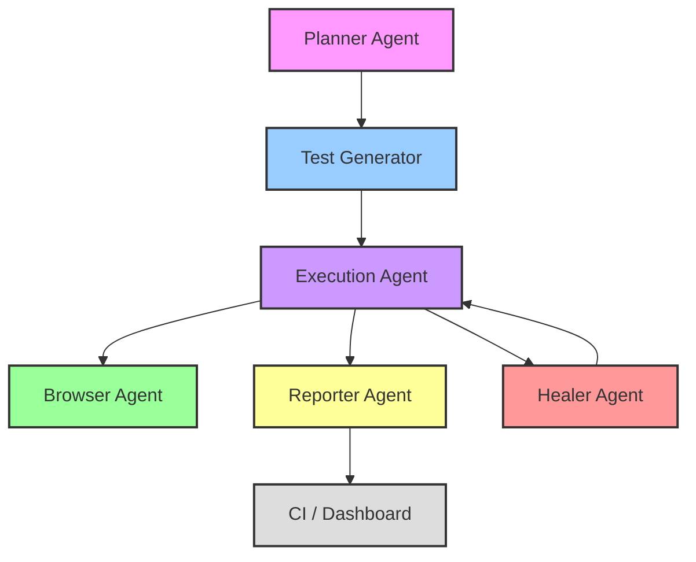
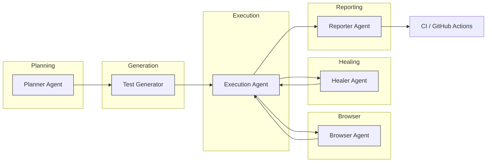

# Architecture Overview

This document describes the automation framework architecture and the agent-based workflow that orchestrates planning, test generation, execution, healing, and reporting.

## Agents and Responsibilities

### Planner Agent
The Planner Agent is responsible for translating product requirements and acceptance criteria into a structured test strategy. It identifies the test scope, selects scenarios, defines data needs, and maps high-level user flows into automation tasks.

### Browser Agent
The Browser Agent acts as the runtime interface to the browser under test. It encapsulates browser actions, page navigation, selector interaction, and environment-specific behavior. In this framework, the Browser Agent is implemented via Playwright page objects that manage page state and user interaction.

### Test Generator
The Test Generator creates executable test cases from the Planner Agent's scenarios. It uses page objects, fixtures, and configuration to generate stable assertions, data-driven flows, and maintainable test code.

### Execution Agent
The Execution Agent runs the generated tests in the target environment. It handles browser lifecycle, parallel execution, retry logic, and collects artifacts such as logs, screenshots, and traces.

### Healer Agent
The Healer Agent is responsible for recovery and stability. If a test fails due to a transient condition or selector drift, this agent can suggest retrying the test, re-evaluating locators, or applying fallback strategies to reduce flake.

### Reporter Agent
The Reporter Agent aggregates results, artifacts, and metrics into actionable outputs. It creates logs, organizes screenshots, exports traces, and optionally integrates with reporting tools such as Allure or CI artifacts.

## Workflow Overview

The workflow follows an agent-oriented pipeline that begins with planning, proceeds through test generation and execution, and ends with healing and reporting.

## Detailed Workflow

### 1. Planning
- The Planner Agent ingests product requirements and user stories.
- It defines the primary end-to-end flows and edge cases to automate.
- It chooses the browsers, test data variants, and environment targets.

### 2. Test Generation
- The Test Generator builds test modules and page object interactions.
- It uses a reusable fixture layer for environment configuration, logging, and browser setup.
- It formulates assertions based on application behavior and expected URLs.

### 3. Execution
- The Execution Agent launches tests through the Playwright runner.
- It supports cross-browser execution and parallel test workers.
- It applies retry logic for transient failures.
- It captures screenshots and traces during test execution.

### 4. Browser Interaction
- The Browser Agent translates testcase steps into actual browser actions.
- It manages page visits, element locators, clicks, form fills, and assertions.
- It isolates browser-specific behavior in page object classes.

### 5. Healing
- The Healer Agent observes failures and determines if recovery is possible.
- It may request a retry on flake, and capture additional diagnostics.
- It identifies selector drift or timing issues and reports them.

### 6. Reporting
- The Reporter Agent collects artifacts after every run.
- It stores screenshots in `screenshots/`, traces in `traces/`, and logs in `logs/`.
- It can integrate with GitHub Actions artifacts, Allure, or other dashboards.

## Agent Collaboration Diagram

## Summary

This architecture separates intent, test generation, browser interaction, execution, healing, and reporting into dedicated agents. The result is a modular, scalable automation framework that supports stable cross-browser validation and CI-driven delivery.
